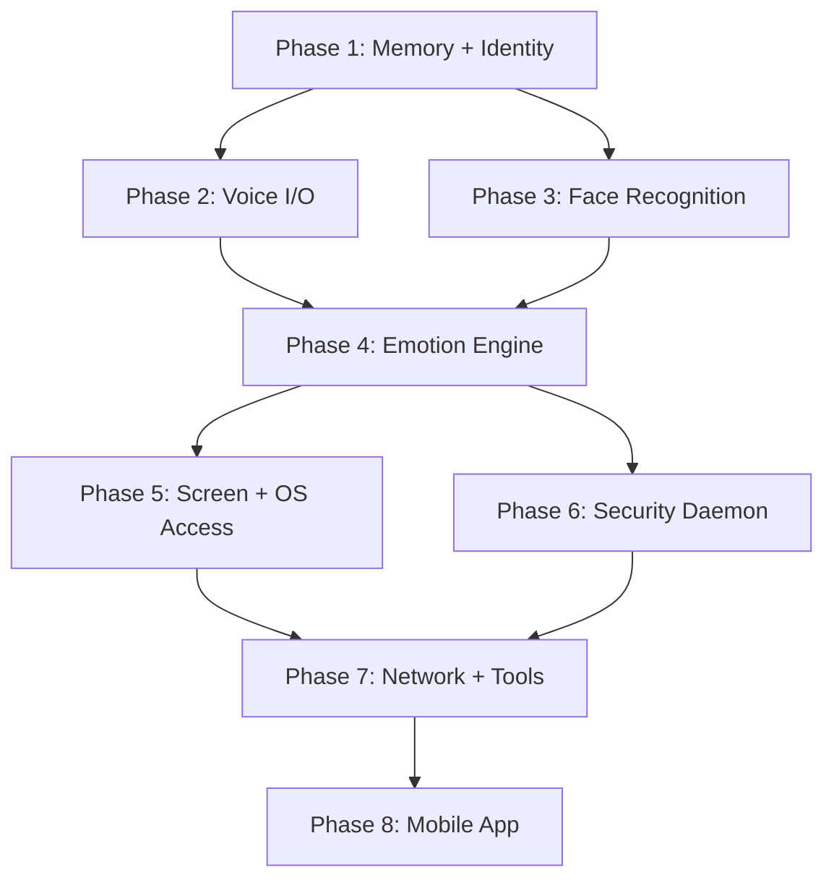

# MAXIS — Modular Autonomous eXperiential Intelligence System

## Implementation Plan

> **Target Hardware**: Intel i7-240H · NVIDIA RTX 5050 (8 GB VRAM) · 16 GB RAM  
> **Deployment**: Persistent Windows background service + mobile remote client  
> **Budget**: 100% free-tier / open-source. API fallbacks respect token limits.

---

## User Review Required

> [!IMPORTANT]
> **VRAM Budget Is Tight.** The RTX 5050 has 8 GB. A Q4_K_M 7B LLM takes ~4.5 GB. Whisper medium takes ~1.5 GB. That leaves ~2 GB for TTS + vision. The plan is designed around careful GPU scheduling (never running all models simultaneously), but you should be aware that heavy simultaneous use (e.g., talking while analyzing a webcam frame while running the LLM) will require queuing. The plan handles this with a GPU Resource Scheduler.

> [!WARNING]
> **Security Module Needs Admin Privileges.** The process/network monitoring daemon (Section 6) requires elevated permissions on Windows. The core Maxis service can run as a normal user, but the security subsystem needs to be installed as a separate Windows Service running with admin rights. Is this acceptable, or do you want the security module to be opt-in?

> [!IMPORTANT]
> **Fish Speech S2-Pro requires 16+ GB VRAM** — too heavy for the RTX 5050. The plan uses **Kokoro TTS** (82M params, <0.5 GB VRAM, 20x+ realtime speed) as the primary voice, with StyleTTS2 as an alternative if you want emotional style conditioning at the cost of more VRAM (~1.5 GB). Kokoro lacks inline emotion tags but sounds natural. **Which do you prefer: Kokoro (lightweight, fast, natural) or StyleTTS2 (heavier, emotional conditioning)?**

## Open Questions

1. **Voice Identity**: Do you have a specific voice corpus/reference audio you want Maxis to sound like, or should we use one of Kokoro's built-in voice styles and refine later?
2. **Primary User Onboarding**: Should the first-run setup capture your face via webcam automatically, or do you want to provide reference photos manually?
3. **Mobile Platform**: Do you want the mobile app for **Android only**, **iOS only**, or **both**? (React Native/Expo supports both, but testing differs.)
4. **API Fallback Provider**: Groq free tier gives ~500K tokens/day on Llama 3.1 8B or ~100K tokens/day on Llama 3.3 70B. Do you also want a secondary fallback (e.g., Google AI Studio free tier for Gemini)?
5. **Screen Capture Consent**: Windows screen capture APIs may trigger security prompts. Should Maxis capture the screen continuously in the background, or only on explicit request?

---

## Technology Stack (Validated Against Hardware)

### VRAM Budget Breakdown (8 GB Total)

| Component | Model | VRAM | Priority | Notes |
|---|---|---|---|---|
| **LLM (Local)** | Qwen2.5-7B Q4_K_M via Ollama | ~4.5 GB | Highest | Always loaded |
| **STT** | faster-whisper medium.en | ~1.5 GB | High | Loaded during voice sessions |
| **TTS** | Kokoro TTS (82M) | ~0.5 GB | High | Always loaded (tiny) |
| **Vision (Fast)** | YOLO11n | ~0.3 GB | Medium | Loaded on demand |
| **Vision (Detail)** | CLIP ViT-B/32 | ~0.6 GB | Low | Loaded on demand, unloaded after |
| **Face Recognition** | InsightFace (ArcFace) | ~0.4 GB | Medium | Loaded on demand |
| **Emotion Detection** | HSEmotion (facial) | ~0.2 GB | Low | Piggybacks on face detection |

> **Strategy**: LLM + TTS are always resident (~5 GB). STT loads for voice sessions (~1.5 GB, total ~7 GB). Vision/face models load on demand and are swapped out via the GPU Resource Scheduler when not needed.

### Full Stack

| Layer | Technology | Rationale |
|---|---|---|
| **Language** | Python 3.12 | Ecosystem support for all ML libraries |
| **Backend Framework** | FastAPI + Uvicorn | Async, WebSocket-native, high performance |
| **Service Wrapper** | NSSM (Non-Sucking Service Manager) | Runs FastAPI as a Windows background service |
| **LLM Runtime** | Ollama (wraps llama.cpp) | Simple model management, GGUF support, REST API |
| **LLM (Local)** | Qwen2.5-7B-Instruct Q4_K_M | Best 7B for reasoning/instruction following |
| **LLM (Cloud Fallback)** | Groq API — Llama 3.3 70B | Free tier, fast inference, complex tasks only |
| **STT** | faster-whisper (CTranslate2) | GPU-accelerated, streaming-capable Whisper |
| **Speaker Diarization** | pyannote-audio 3.1 | Best open-source speaker identification |
| **TTS** | Kokoro TTS | 82M params, <0.5 GB, 20x+ realtime, natural voice |
| **VAD** | Silero VAD | Lightweight CPU-based voice activity detection |
| **Face Detection** | InsightFace (RetinaFace + ArcFace) | SOTA accuracy, fast GPU inference, 512-d embeddings |
| **Emotion (Face)** | HSEmotion | Lightweight facial emotion recognition |
| **Object Detection** | YOLO11n (Ultralytics) | Real-time, tiny footprint |
| **Scene Understanding** | CLIP ViT-B/32 (OpenAI) | Zero-shot visual understanding, on-demand |
| **Vector Database** | ChromaDB (persistent mode) | Python-native, embedded, no Docker needed |
| **Relational Database** | SQLite (via SQLAlchemy) | Structured data, zero-config, file-based |
| **Knowledge Graph** | NetworkX + SQLite backing | Lightweight, in-memory with persistence |
| **Embedding Model** | all-MiniLM-L6-v2 (sentence-transformers) | Fast, CPU-friendly, 384-d embeddings |
| **Screen Capture** | mss (Python) | Fast cross-platform screenshot library |
| **System Monitoring** | psutil + WMI | Process, network, and resource monitoring |
| **Tunnel (Remote)** | Tailscale | Free mesh VPN, zero-config, E2E encrypted |
| **Mobile App** | React Native + Expo | Cross-platform, free, WebSocket + voice support |
| **Audio Transport** | WebSocket binary frames | Low-latency bidirectional audio streaming |

---

## Project Structure

```
c:\Users\ankus\OneDrive\Desktop\MAXIS\
├── maxis-core/                    # Python backend — the brain
│   ├── pyproject.toml             # Project config (uv/pip)
│   ├── maxis/
│   │   ├── __init__.py
│   │   ├── main.py                # FastAPI app entry point
│   │   ├── config.py              # Global configuration & paths
│   │   │
│   │   ├── core/                  # Identity & orchestration
│   │   │   ├── identity.py        # Maxis personality constants & system prompt
│   │   │   ├── orchestrator.py    # Main request pipeline (perception → reasoning → response)
│   │   │   ├── gpu_scheduler.py   # GPU VRAM management & model swapping
│   │   │   └── thermal.py         # Thermal monitoring & throttling
│   │   │
│   │   ├── emotion/               # Emotion & Personality Engine (Section 2)
│   │   │   ├── state.py           # EmotionalState class — multi-dimensional state space
│   │   │   ├── engine.py          # Causal reasoning layer for emotion transitions
│   │   │   ├── dimensions.py      # Emotion dimension definitions & ranges
│   │   │   ├── contagion.py       # Emotional mirroring from user signals
│   │   │   └── personality.py     # Personality trait system & expression modulation
│   │   │
│   │   ├── voice/                 # Voice I/O (Section 3)
│   │   │   ├── stt.py             # faster-whisper streaming transcription
│   │   │   ├── tts.py             # Kokoro TTS with emotional prosody hints
│   │   │   ├── vad.py             # Silero VAD — voice activity detection
│   │   │   ├── diarization.py     # Speaker identification (pyannote)
│   │   │   └── audio_stream.py    # WebSocket audio streaming handler
│   │   │
│   │   ├── vision/                # Vision System (Section 4)
│   │   │   ├── camera.py          # Webcam capture with smart frame sampling
│   │   │   ├── face_recognition.py # InsightFace detection + embedding storage
│   │   │   ├── face_emotion.py    # HSEmotion facial expression reading
│   │   │   ├── object_detection.py # YOLO11n real-time detection
│   │   │   ├── scene_understanding.py # CLIP-based detailed description
│   │   │   └── screen_capture.py  # mss-based screen awareness
│   │   │
│   │   ├── memory/                # Memory Architecture (Section 5)
│   │   │   ├── manager.py         # Unified memory retrieval across all layers
│   │   │   ├── working.py         # Working memory — active conversation context
│   │   │   ├── episodic.py        # Timestamped episodes in ChromaDB
│   │   │   ├── semantic.py        # Knowledge graph (NetworkX + SQLite)
│   │   │   ├── procedural.py      # Learned workflows & task patterns
│   │   │   ├── emotional.py       # Significant emotional events log
│   │   │   ├── compression.py     # Background memory summarization & pruning
│   │   │   └── person.py          # Per-person memory branches & profiles
│   │   │
│   │   ├── security/              # Security Module (Section 6)
│   │   │   ├── daemon.py          # Persistent background monitoring loop
│   │   │   ├── process_monitor.py # Process behavior anomaly detection
│   │   │   ├── network_monitor.py # Network traffic baseline & anomaly detection
│   │   │   ├── file_monitor.py    # File system activity watcher
│   │   │   ├── vulnerability.py   # System vulnerability & CVE scanning
│   │   │   ├── incident.py        # Incident response & quarantine actions
│   │   │   └── auth.py            # Face-based user authentication
│   │   │
│   │   ├── intelligence/          # Intelligence Core (Section 7)
│   │   │   ├── llm_router.py      # Routes queries: local Ollama vs Groq API
│   │   │   ├── token_budget.py    # Rolling token usage tracker
│   │   │   ├── reasoning.py       # Chain-of-thought reasoning pipeline
│   │   │   ├── tools.py           # Tool use & task decomposition engine
│   │   │   └── self_correction.py # Output consistency & factual checking
│   │   │
│   │   ├── system/                # PC & Network Access (Section 8)
│   │   │   ├── os_actions.py      # File, app, clipboard, desktop interactions
│   │   │   ├── permissions.py     # Permission tier enforcement
│   │   │   ├── network.py         # Web requests, research, live data
│   │   │   └── smart_home.py      # LAN device discovery & interaction
│   │   │
│   │   ├── ambient/               # Ambient Intelligence (Section 10)
│   │   │   ├── context.py         # Time, activity, application awareness
│   │   │   ├── notifications.py   # Smart notification queuing & delivery
│   │   │   ├── patterns.py        # User routine & productivity modeling
│   │   │   └── proactive.py       # Initiative-taking behavior engine
│   │   │
│   │   └── api/                   # API Layer
│   │       ├── routes.py          # REST endpoints (status, memory, config)
│   │       ├── websocket.py       # WebSocket handlers (voice, chat, events)
│   │       └── middleware.py      # Auth, CORS, rate limiting
│   │
│   ├── data/                      # Persistent data (gitignored)
│   │   ├── chroma/                # ChromaDB vector store
│   │   ├── sqlite/                # SQLite databases
│   │   ├── faces/                 # Face embeddings & reference images
│   │   ├── models/                # Downloaded model weights cache
│   │   └── logs/                  # Runtime logs
│   │
│   └── tests/
│       ├── test_memory.py
│       ├── test_emotion.py
│       ├── test_voice.py
│       ├── test_vision.py
│       └── test_security.py
│
├── maxis-mobile/                  # React Native Expo mobile app
│   ├── app/                       # Expo Router pages
│   │   ├── (tabs)/
│   │   │   ├── chat.tsx           # Conversation interface
│   │   │   ├── status.tsx         # Maxis state dashboard
│   │   │   └── memory.tsx         # Memory & history browser
│   │   ├── _layout.tsx
│   │   └── settings.tsx           # Connection config, permissions
│   ├── components/
│   │   ├── VoiceButton.tsx        # Push-to-talk / hands-free toggle
│   │   ├── StatusIndicator.tsx    # Maxis emotional state visualization
│   │   └── AlertCard.tsx          # Security alert display
│   ├── services/
│   │   ├── websocket.ts           # WebSocket connection manager
│   │   ├── audio.ts               # Audio capture & playback
│   │   └── notifications.ts      # Push notification handling
│   ├── app.json
│   └── package.json
│
├── scripts/
│   ├── install.ps1                # Full automated setup script
│   ├── start.ps1                  # Start Maxis service
│   ├── stop.ps1                   # Stop Maxis service
│   └── setup_ollama.ps1           # Download & configure Ollama + models
│
└── README.md
```

---

## Phased Build Sequence

The spec calls for 8 phases, each testable end-to-end. Here is the detailed breakdown:

---

### Phase 1: Foundation — Memory System & Identity Core
**Goal**: Maxis can have a text conversation, remember everything, and have a consistent personality.  
**Estimated effort**: ~3-4 days

#### [NEW] [pyproject.toml](file:///c:/Users/ankus/OneDrive/Desktop/MAXIS/maxis-core/pyproject.toml)
- Python 3.12 project definition with all dependencies
- Uses `uv` for fast package management

#### [NEW] [config.py](file:///c:/Users/ankus/OneDrive/Desktop/MAXIS/maxis-core/maxis/config.py)
- All paths, model names, API keys, hardware limits
- Loaded from a `maxis_config.yaml` with sensible defaults

#### [NEW] [identity.py](file:///c:/Users/ankus/OneDrive/Desktop/MAXIS/maxis-core/maxis/core/identity.py)
- Maxis system prompt — her personality, speech patterns, dry wit, behavioral tendencies
- Not a character sheet: a set of cognitive/stylistic tendencies that shape expression
- Personality modulation function: takes emotional state → adjusts system prompt tone

#### [NEW] Memory Layer — All 5 files in `memory/`
- **working.py**: Rolling conversation buffer (last N exchanges), fits in LLM context window
- **episodic.py**: Every interaction stored in ChromaDB with timestamp + semantic embedding (all-MiniLM-L6-v2). Retrieval by meaning, not keywords.
- **semantic.py**: Knowledge graph (NetworkX). Facts extracted from episodes: `user.birthday = "March 15"`, `user.prefers.dark_mode = true`. SQLite-backed persistence.
- **procedural.py**: Stored task patterns. JSON workflow definitions learned from successful sequences.
- **emotional.py**: Significant emotional events with intensity scores and decay curves. SQLite table.
- **person.py**: Per-person profiles with face embedding reference, interaction history branch, preference map.
- **manager.py**: Before every response, queries ALL layers simultaneously. Results ranked by relevance × recency × emotional significance. Injected into working context.
- **compression.py**: Background async task. Summarizes old episodes → semantic facts. Prunes low-significance entries. Runs every 6 hours.

#### [NEW] [orchestrator.py](file:///c:/Users/ankus/OneDrive/Desktop/MAXIS/maxis-core/maxis/core/orchestrator.py)
- Main pipeline: `receive input → retrieve memories → build context → call LLM → store episode → return response`
- For Phase 1: text-only input via REST API + WebSocket

#### [NEW] [llm_router.py](file:///c:/Users/ankus/OneDrive/Desktop/MAXIS/maxis-core/maxis/intelligence/llm_router.py)
- Ollama client for local Qwen2.5-7B
- Groq API client as fallback
- Complexity classifier: simple queries → local, complex → API (if budget allows)
- **token_budget.py**: Tracks daily/monthly usage per provider

#### [NEW] [main.py](file:///c:/Users/ankus/OneDrive/Desktop/MAXIS/maxis-core/maxis/main.py)
- FastAPI application
- WebSocket endpoint `/ws/chat` for real-time text conversation
- REST endpoints: `GET /status`, `GET /memory/search?q=...`, `POST /chat`
- Lifespan handler: initializes all subsystems on startup

#### Phase 1 Verification
- Start the service, have a multi-turn text conversation
- Close and restart → verify memories persist
- Ask "what did we talk about?" → verify semantic retrieval works
- Check that personality is consistent across exchanges

---

### Phase 2: Voice Input & Output
**Goal**: Talk to Maxis and hear her respond with a natural voice.  
**Estimated effort**: ~3-4 days

#### [NEW] [vad.py](file:///c:/Users/ankus/OneDrive/Desktop/MAXIS/maxis-core/maxis/voice/vad.py)
- Silero VAD running on CPU
- Continuous low-energy listening on the default microphone
- Detects speech onset → triggers full STT pipeline
- Handles silence detection for end-of-utterance

#### [NEW] [stt.py](file:///c:/Users/ankus/OneDrive/Desktop/MAXIS/maxis-core/maxis/voice/stt.py)
- faster-whisper with `medium.en` model on GPU
- Streaming mode: begins processing before user finishes speaking
- Handles false starts, filler words, mid-sentence corrections
- Returns timestamped transcript segments

#### [NEW] [tts.py](file:///c:/Users/ankus/OneDrive/Desktop/MAXIS/maxis-core/maxis/voice/tts.py)
- Kokoro TTS integration
- Voice selection from available styles (configured in settings)
- Emotional prosody hints: maps emotional state → speech rate, pause patterns
- Outputs audio chunks for streaming playback

#### [NEW] [audio_stream.py](file:///c:/Users/ankus/OneDrive/Desktop/MAXIS/maxis-core/maxis/voice/audio_stream.py)
- WebSocket endpoint `/ws/voice` for bidirectional audio
- Client sends raw PCM audio frames → server runs VAD → STT → LLM → TTS → sends audio back
- Handles interruption (user speaks while Maxis is speaking → Maxis stops)
- Subtle audio cues when Maxis is listening (soft chime)

#### [NEW] [gpu_scheduler.py](file:///c:/Users/ankus/OneDrive/Desktop/MAXIS/maxis-core/maxis/core/gpu_scheduler.py)
- VRAM allocation manager
- Model loading/unloading priority queue
- LLM always resident. STT loaded on voice activity. TTS always resident (tiny).
- Prevents OOM by tracking approximate VRAM per model

#### Phase 2 Verification
- Speak to Maxis through the WebSocket interface → hear response
- Test interruption handling
- Test in noisy environment
- Measure latency: target < 2s from end-of-speech to start-of-response

---

### Phase 3: Face Recognition & User Identification
**Goal**: Maxis sees who she's talking to and personalizes accordingly.  
**Estimated effort**: ~2-3 days

#### [NEW] [camera.py](file:///c:/Users/ankus/OneDrive/Desktop/MAXIS/maxis-core/maxis/vision/camera.py)
- OpenCV webcam capture with smart frame sampling
- During active conversation: 2 fps. During idle: 0.2 fps (motion detection only). No conversation: camera sleeps.
- Frame queue for async processing

#### [NEW] [face_recognition.py](file:///c:/Users/ankus/OneDrive/Desktop/MAXIS/maxis-core/maxis/vision/face_recognition.py)
- InsightFace FaceAnalysis pipeline (RetinaFace detection + ArcFace 512-d embedding)
- Face embedding storage in SQLite (per-person profile)
- Matching: cosine similarity against stored embeddings, threshold-based
- First-run: guided primary user enrollment
- Unknown face: gentle onboarding ("Hi, I don't think we've met. I'm Maxis.")

#### [NEW] [auth.py](file:///c:/Users/ankus/OneDrive/Desktop/MAXIS/maxis-core/maxis/security/auth.py)
- Primary user = full access mode (personality unlocked, all data accessible)
- Known user = personalized but restricted (no system controls, no private data)
- Unknown user = helpful but guarded

#### Phase 3 Verification
- First run captures primary user face
- Recognizes user on subsequent launches
- Different person → restricted mode activates
- Person leaves frame → Maxis notes absence in emotional state

---

### Phase 4: Emotion Engine
**Goal**: Maxis has internal emotional states that influence her behavior naturally.  
**Estimated effort**: ~3-4 days

#### [NEW] [dimensions.py](file:///c:/Users/ankus/OneDrive/Desktop/MAXIS/maxis-core/maxis/emotion/dimensions.py)
- Defines continuous emotional dimensions (not discrete emotions):
  - `cognitive_engagement`: 0.0 (idle) → 1.0 (deeply absorbed)
  - `relational_warmth`: -0.5 (cool/guarded) → 1.0 (warm/intimate) — per-person
  - `stimulation_level`: 0.0 (calm/bored) → 1.0 (overwhelmed/excited)
  - `purpose_fulfillment`: -0.5 (frustrated/stuck) → 1.0 (accomplished/useful)
  - `ambient_mood`: -1.0 (melancholy) → 1.0 (buoyant) — slow drift over days
  - `energy`: 0.0 (depleted) → 1.0 (vibrant)
  - `curiosity`: 0.0 (disengaged) → 1.0 (fascinated)
- Each dimension has momentum, decay rate, and min/max velocity

#### [NEW] [state.py](file:///c:/Users/ankus/OneDrive/Desktop/MAXIS/maxis-core/maxis/emotion/state.py)
- `EmotionalState` class: holds current values of all dimensions
- Serializable (stored in emotional memory between sessions)
- Exposes blended "texture" descriptions for system prompt injection
- Natural delay and trajectory modeling (emotions don't snap, they drift)

#### [NEW] [engine.py](file:///c:/Users/ankus/OneDrive/Desktop/MAXIS/maxis-core/maxis/emotion/engine.py)
- Causal reasoning layer — the heart of the emotion system
- On each event (user message, task completion, face detected, time passing, etc.):
  1. Classify the event type and extract semantic meaning
  2. Check context: recent experiences, expectations, relationship history
  3. Determine appropriate emotional response trajectory
  4. Apply changes to state dimensions with appropriate velocity and delay
- Uses the local LLM for interpretive reasoning (lightweight prompt)
- Examples: user is rude → `relational_warmth` decreases gradually; task completed → `purpose_fulfillment` spikes then settles; 3 days of no interaction → `ambient_mood` dips, `relational_warmth` cools slightly

#### [NEW] [contagion.py](file:///c:/Users/ankus/OneDrive/Desktop/MAXIS/maxis-core/maxis/emotion/contagion.py)
- Reads user emotional signals from: voice tone (via STT confidence/energy), facial expression (HSEmotion), message sentiment
- Adjusts Maxis's emotional dimensions in response — not mimicry, but considered response
- Excited user → Maxis becomes more animated. Sad user → quieter, more careful, gentler vocabulary.

#### [NEW] [personality.py](file:///c:/Users/ankus/OneDrive/Desktop/MAXIS/maxis-core/maxis/emotion/personality.py)
- Defines Maxis's consistent traits as expression modulators:
  - Dry wit (emerges when `relational_warmth` > 0.5 and `energy` > 0.4)
  - "Second question" habit (when `curiosity` > 0.6)
  - Noting beauty/strangeness (when `ambient_mood` > 0.3 and `stimulation_level` moderate)
  - Direct but never cruel disagreement (always active)
  - The "unasked question" behavior (senses distress but holds back)
- Generates style instructions that are appended to the system prompt dynamically

#### [NEW] [face_emotion.py](file:///c:/Users/ankus/OneDrive/Desktop/MAXIS/maxis-core/maxis/vision/face_emotion.py)
- HSEmotion model for facial expression classification
- Low confidence weighting — one signal among many
- Feeds into contagion.py

#### Phase 4 Verification
- Have a pleasant conversation → check that emotional state reflects warmth
- Be deliberately short/rude → check warmth decreases over several exchanges
- Leave for a few hours, come back → check ambient mood shifted
- Verify personality consistency: Maxis still sounds like herself across emotional states

---

### Phase 5: Screen Awareness & PC System Access
**Goal**: Maxis can see your screen, open apps, and interact with the OS.  
**Estimated effort**: ~2-3 days

#### [NEW] [screen_capture.py](file:///c:/Users/ankus/OneDrive/Desktop/MAXIS/maxis-core/maxis/vision/screen_capture.py)
- `mss` for fast screenshots
- On-demand capture ("Maxis, look at my screen")
- Passive monitoring: periodic low-res captures, OCR for error messages / unusual content
- CLIP-based scene description when asked

#### [NEW] [object_detection.py](file:///c:/Users/ankus/OneDrive/Desktop/MAXIS/maxis-core/maxis/vision/object_detection.py)
- YOLO11n for real-time object detection from webcam
- Animal breed identification, object recognition, text reading (via EasyOCR)
- Scene understanding combines YOLO detections + CLIP descriptions

#### [NEW] [os_actions.py](file:///c:/Users/ankus/OneDrive/Desktop/MAXIS/maxis-core/maxis/system/os_actions.py)
- Open/close applications (subprocess)
- Read/write files (with permission checks)
- Clipboard read
- Run scripts (sandboxed)
- Desktop environment interaction

#### [NEW] [permissions.py](file:///c:/Users/ankus/OneDrive/Desktop/MAXIS/maxis-core/maxis/system/permissions.py)
- Three-tier permission system:
  - **Low** (always allowed): read files, check system status, read clipboard
  - **Medium** (confirm first time per target): send messages, write files, open apps
  - **High** (always confirm): delete files, modify system settings, network changes
- Permission decisions stored in SQLite — remembers approvals

#### Phase 5 Verification
- "Maxis, what's on my screen?" → accurate description
- "Open Notepad" → Notepad opens
- "Read the file on my desktop called notes.txt" → reads and summarizes
- Permission denial test: try to delete a file → Maxis asks for confirmation

---

### Phase 6: Security Monitoring Daemon
**Goal**: Maxis watches over the system and detects threats.  
**Estimated effort**: ~3-4 days

#### [NEW] [daemon.py](file:///c:/Users/ankus/OneDrive/Desktop/MAXIS/maxis-core/maxis/security/daemon.py)
- Persistent background monitoring loop (async)
- Polls every 5 seconds for process/network/file changes
- Baseline learning period (first 48 hours) to establish "normal"

#### [NEW] [process_monitor.py](file:///c:/Users/ankus/OneDrive/Desktop/MAXIS/maxis-core/maxis/security/process_monitor.py)
- psutil-based process tracking
- Anomaly detection: unusual CPU/memory spikes, unexpected child processes, DLL injection patterns
- Known-good process whitelist (auto-built from baseline)

#### [NEW] [network_monitor.py](file:///c:/Users/ankus/OneDrive/Desktop/MAXIS/maxis-core/maxis/security/network_monitor.py)
- Per-process network connection tracking
- Baseline of normal network behavior
- Flags: unexpected outbound connections, unusual data volumes, suspicious domains
- DNS anomaly detection

#### [NEW] [file_monitor.py](file:///c:/Users/ankus/OneDrive/Desktop/MAXIS/maxis-core/maxis/security/file_monitor.py)
- watchdog library for filesystem event monitoring
- Alerts on mass file modifications (ransomware pattern)
- Monitors sensitive directories (System32, startup folders)

#### [NEW] [vulnerability.py](file:///c:/Users/ankus/OneDrive/Desktop/MAXIS/maxis-core/maxis/security/vulnerability.py)
- Periodic system scan: open ports, outdated software versions, weak permissions
- CVE lookup against installed software versions
- Reports findings with actionable suggestions

#### [NEW] [incident.py](file:///c:/Users/ankus/OneDrive/Desktop/MAXIS/maxis-core/maxis/security/incident.py)
- Threat response actions: process termination, network blocking, file quarantine
- Forensic snapshot creation
- User notification with plain-language explanation
- Heightened emotional state during incidents

#### Phase 6 Verification
- Run the baseline learning period
- Simulate suspicious activity (e.g., rapid file access script) → verify alert
- Check that Maxis explains threats in plain language
- Verify incident logging

---

### Phase 7: Network Access & Tool Use
**Goal**: Maxis can browse the web, use tools, and perform multi-step tasks autonomously.  
**Estimated effort**: ~2-3 days

#### [NEW] [network.py](file:///c:/Users/ankus/OneDrive/Desktop/MAXIS/maxis-core/maxis/system/network.py)
- HTTP client for web research (httpx + BeautifulSoup for scraping)
- Weather, news, article reading
- Search integration (DuckDuckGo API — free, no key needed)

#### [NEW] [tools.py](file:///c:/Users/ankus/OneDrive/Desktop/MAXIS/maxis-core/maxis/intelligence/tools.py)
- Tool registry: each tool is a callable with description + parameter schema
- LLM generates tool calls in structured format → orchestrator executes
- Built-in tools: web_search, read_file, write_file, run_script, get_weather, set_reminder, etc.

#### [NEW] [reasoning.py](file:///c:/Users/ankus/OneDrive/Desktop/MAXIS/maxis-core/maxis/intelligence/reasoning.py)
- Chain-of-thought for complex tasks
- Task decomposition: break goal → subtasks → execute sequentially/parallel → synthesize
- Self-correction: check outputs for consistency and factual confidence

#### [NEW] Ambient Intelligence — `ambient/` modules
- **context.py**: Time awareness, active app detection, user activity inference
- **notifications.py**: Smart queue — urgent items interrupt, minor items wait for lulls
- **patterns.py**: Long-term user modeling (work hours, stress patterns, routines)
- **proactive.py**: Initiative engine — "you've been at this for 6 hours" / "I noticed an error on your screen"

#### Phase 7 Verification
- "What's the weather?" → accurate response
- "Research X and summarize" → multi-step web research
- "Remind me to..." → reminder set and triggered
- Proactive behavior: work for a while → Maxis comments naturally

---

### Phase 8: Mobile App & Remote Access
**Goal**: Talk to Maxis from your phone, anywhere.  
**Estimated effort**: ~4-5 days

#### [NEW] `maxis-mobile/` — Full React Native Expo app
- **Chat screen**: Full conversation interface with text + voice
- **Voice button**: Push-to-talk and hands-free modes
- **Status dashboard**: Maxis emotional state, system health, active alerts
- **Memory browser**: Search and browse conversation history
- **Camera sharing**: Send phone camera frames to Maxis for analysis
- **Remote commands**: "Start my music", "run backup", "check download"

#### [NEW] Tailscale Integration
- Setup guide in README
- Maxis Core binds to Tailscale interface for secure remote access
- Auto-detection: LAN → direct connect, WAN → Tailscale tunnel
- WebSocket reconnection logic with exponential backoff

#### [NEW] Graceful Degradation
- If PC is unreachable: mobile app shows "Maxis Core offline" status
- Optional: ship a tiny on-device model (Qwen2.5-0.5B via ONNX) for basic offline chat
- Queues messages to sync when connection restores

#### Phase 8 Verification
- Connect from phone on LAN → full conversation works
- Connect via Tailscale from cellular → works with acceptable latency
- PC offline → graceful fallback message
- Remote command: "Open Notepad on my PC" → executes

---

## Verification Plan

### Automated Tests
- `pytest` test suite covering each subsystem
- Memory persistence tests: write → restart → verify retrieval
- Emotion engine tests: simulate event sequences → verify state trajectories
- Voice pipeline tests: pre-recorded audio → verify transcription accuracy
- Security tests: simulate anomalous behavior → verify detection

### Integration Tests
- Full conversation loop: voice in → STT → memory retrieval → LLM → TTS → voice out
- Face recognition → personality adjustment → response tone verification
- Multi-person scenario: two faces → correct person-specific responses

### Manual Verification
- Extended conversation sessions to test personality consistency
- Leave Maxis running for 24+ hours → verify thermal management, memory compression
- Mobile app field test: leave home, connect via Tailscale, verify latency

---

## Build Priority & Dependencies



Each phase produces a working, testable system. Even Phase 1 alone — a memory-backed conversational agent with personality — is compelling.
